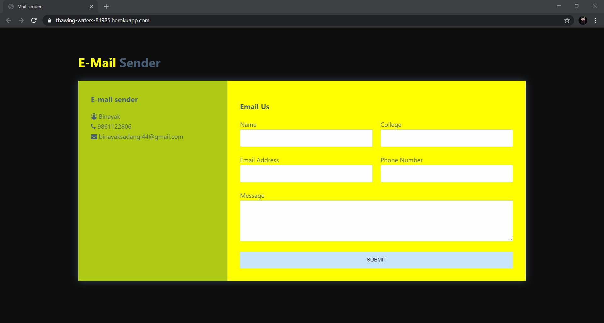
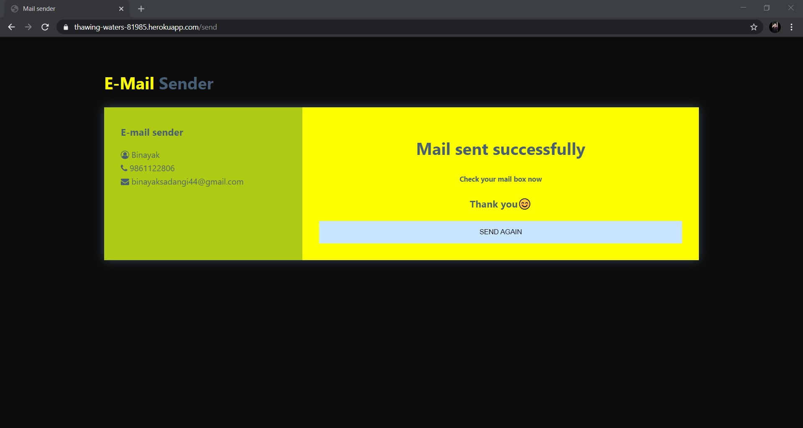

# Node_Mailer
### Description
This is a mail sender node application which uses the  nodeMailer node module. You need to turn on 3rd party permission for your google account through which you will be sending mail.  
### To turn on the permission go [here](https://myaccount.google.com/lesssecureapps?pli=1&rapt=AEjHL4PtozVxOBHy3D-bonWmshJV8SVZ7NUiy0KB9UhkDC2j1NrMDzmIbAIMKXsrhHXw0n8DVCWcYiPFb6cek07DU5EiBCabvw)
 
### Languages and Tools
 

 

### Demonstration
This is the interface of my Node App  
### view 1
 
### view 2

